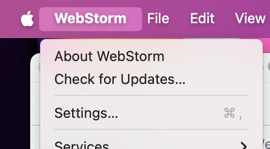
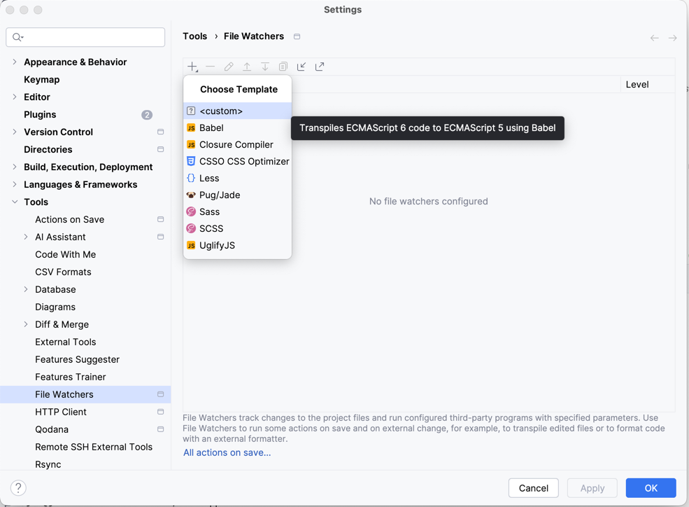
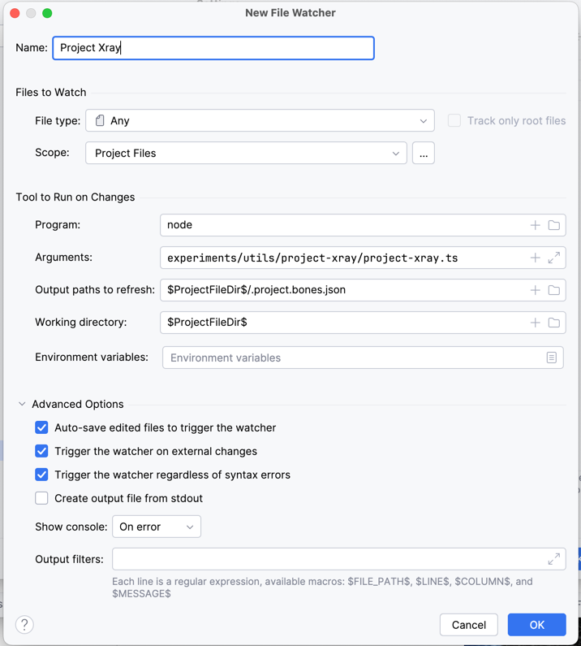

# project-xray

A tool to keep a human- and LLM-friendly summary of your project's structure on hand and auto-generated every time you save a file.

LLMs require detailed context to make good coding assistants, but large codebases flood LLMs with extraneous-- sometimes confusing-- details, and costs loads more tokens as it does. 

This script extracts several essential project details from the codebase-- file structures, modules, entry points, API calls, git history, etc-- into a compact `.bones.json` summary.

*🔒Security note: this tool does not make any external calls, and is not LLM-based. The details are extracted entirely through local file parsing and local git commands.*

## What it does

Consider your average codebase:

```
📁 project/
  📁 src/
    📁 modules/
    📁 services/
    📄 main.ts
  📁 test/
  📄 package.json
  ... (hundreds more files and folders)
```

This script will generate a concise summary (these are sketches):

`.project.bones.json`
```json
{
   "project": {"name": "my-app", "version": "1.0.0"},
   "repository": {"branch": "main"},
   "stats": {
      "totalFiles": 42,
      "totalLines": 3500,
      "linesPerFileType": {".ts": 2800, ".js": 500}
   },
   "projectFileTree": "📁 src/\n  📁 modules/\n  📁 services/\n  📄 main.ts",
   "entryPoints": {"main": ["src/main.ts"]},
   "dependencies": ["express", "nestjs", "mongoose"]
}
```

`.project.bones.md`

> # Project Summary: my-app v1.0.0
> 
> ## Repository Information
> - **Branch:** main
> 
> ## Project Statistics
> - **Total Files:** 42
> - **Total Lines:** 3,500
> - **Lines by File Type:**
>    - TypeScript (.ts): 2,800
>    - JavaScript (.js): 500
> 
> ## Project Structure
> ```
> 📁 project/
> │
> ├── 📁 src/
> │   ├── 📁 modules/ ...
> │   ├── 📁 services/ ...
> │   └── 📄 main.ts
> │
> ├── 📁 test/
> ├── 📄 package.json
> └── ... (hundreds more files and folders)
> ```
> ## Entry Points
> - **Main:** src/main.ts
> 
> ## Dependencies
> - express
> - nestjs
> - mongoose


## Complete example
- The [FreeMoCap/Skellybot](https://github.com/freemocap/skellybot) repo
- [examples/skellybot.project.bones.json](./examples/skellybot.project.bones.json) - the data extracted
- [examples/skellybot.project.bones.md](./examples/skellybot.project.bones.md) - the more compact and readable report

## Installation

1. Copy the `project-xray.mjs` file into your project (any location works)
2. Run it from your project root:

```bash
node path/to/project-xray.mjs
```

3. Check the generated `.project.bones.json` in your project root

> You can specify folders to explicitly ignore in the xray process in an `.xray-ignore` file, same shape as a `.gitignore`
> Place that file either in your project root or in the same directory as the `project-xray.mjs` file.

## WebStorm Auto-Update Setup

Set up WebStorm to automatically update the project bones whenever you save files:

1. Open Settings/Preferences



2. Go to Tools → File Watchers Click "+" and select "Custom"



3. Configure the watcher:
    - Name: "Project X-Ray" (or whatever label)
    - File type: Any
    - Program: `node`
    - Arguments: `$ProjectFileDir$/path/to/your/project-xray.mjs`
    - Ourput paths: `$ProjectFileDir$/.project.bones.json, $ProjectFileDir$/.project.bones.md`
    - Working directory: `$ProjectFileDir$`




4. Click OK to save

> ⚠️Note that it can take a bit of time for the files to pop up in webstorm on first running, due to some odd refreshing behavior we don't fully understand yet. Once the files exist, though, they should update fairly quickly in your editor. 

**Tip:** Keep `.project.bones.md` open in your IDE to more easily include it when using AI assistant tools.

## Optimal Project Structure for Best Results

Project-Xray works best with:

1. **Git Repository**
    - Standard `.gitignore` setup

2. **Node.js Project Structure**
    - `package.json` with dependencies
    - Standard directory structure (preferably with a `src` directory)

3. **File Organization**
    - Conventional naming patterns:
        - `*.module.ts` for modules
        - `*.service.ts` for services
        - `*.controller.ts` for controllers
        - `*.command.ts` for commands
        - `*.dto.ts` for DTOs
        - `*.schema.ts` for schemas

4. **Environment Variables**
    - `.env` files (variables detected but values not exposed)

5. **Code Patterns**
    - HTTP requests (`axios`, `fetch`)
    - Database operations (especially MongoDB/Mongoose)
    - External API integrations (OpenAI, Discord, etc.)
    - Event handlers

Works particularly well with NestJS projects but should be compatible with any Node.js project.

## Details extracted
- **Project Structure**: Helps LLMs understand the organization of your codebase.
- **Entry Points**: Identifies the main files to focus on.
- **Modules/Services**: Provides a high-level overview of the codebase.
- **Git History**: Offers context on recent changes and contributions.
- **API Calls**: Highlights external dependencies and integrations.
- **Environment Variables**: Ensures sensitive information is not exposed.
- **File Patterns**: Helps LLMs recognize common coding patterns and structures.
- *Consider this a growing list! While the goal is to give a concise summary, these extracted crucial operational details are very small and worth far more than their weight in tokens.*


Basically, this helps keeps the ins-and-outs of the project "in mind" without having to jam stacks of files in. 
This is exceptionally useful for helping the model keep track of things it DOES NOT have in its context window presently. 

