# skellybot v0.0.1

*(The information in this document is algorithmically parsed from project files and may not be exhaustive or complete, but should give a detailed sketch of the repo.)*

## Project Overview

 - **Description**: No description available
- **Branch**: ai_project_utility
- **Last Commit**: 6906572 - Merge pull request #40 from JacKaL37/chat_command_llm_option (jonmatthis, 9 days ago)
- **Total Files**: 111
- **Total Lines**: 9,671

## Stats

### Lines per File Type

- **.ts**: 9,644
- **.js**: 27

### Largest Files

- `experiments/utils/project-xray/old/project-xray1.ts`: 1,422 lines
- `experiments/utils/project-xray/old/project-xray-alt.ts`: 966 lines
- `experiments/utils/project-xray/old/project-xray3.ts`: 912 lines
- `experiments/utils/project-xray/old/project-xray2.ts`: 858 lines
- `src/interfaces/discord/services/discord-message.service.ts`: 313 lines
- `src/core/ai/openai/openai-chat.service.ts`: 286 lines
- `src/interfaces/discord/commands/server-config-command/discord-deploy-server-command.service.ts`: 249 lines
- `experiments/analysis/server-scraper/services/scrapeService.ts`: 236 lines
- `src/interfaces/discord/services/discord-context-prompt.service.ts`: 227 lines
- `src/interfaces/discord/commands/server-config-command/server-config-schema.ts`: 223 lines

## File Structure

```
├── .dockerignore
├── .env.analysis.example
├── .env.discord.example
├── .env.mongo
├── .env.openai.example
├── .env.slack.example
├── .eslintrc.js
├── .gitignore
├── .prettierrc
├── Dockerfile
├── Dockerfile.exp
├── LICENSE
├── README.md
├── bin
│   └── builds
│       └── install_packages
├── docker-compose.yml
├── experiments
│   ├── analysis
│   │   ├── ai-stuff
│   │   │   └── ai-analysis-main.ts
│   │   └── server-scraper
│   │       ├── serverScraper-main.ts
│   │       └── services
│   │           ├── botService.ts
│   │           ├── data-types.ts
│   │           ├── envService.ts
│   │           ├── json-to-md-directory.ts
│   │           ├── jsonFileService.ts
│   │           └── scrapeService.ts
│   └── utils
│       └── project-xray
│           ├── .xray-ignore
│           ├── .xray-ignore.example
│           ├── README.md
│           ├── docs
│           │   ├── img.png
│           │   ├── img_1.png
│           │   └── img_2.png
│           ├── examples
│           │   └── skellybot.project.bones.json
│           ├── old
│           │   ├── project-xray-alt.ts
│           │   ├── project-xray1.ts
│           │   ├── project-xray2.ts
│           │   └── project-xray3.ts
│           └── project-xray.mjs
├── gcloud
│   └── GCE.txt
├── nest-cli.json
├── package-lock.json
├── package.json
├── pyproject.toml
├── src
│   ├── core
│   │   ├── ai
│   │   │   └── openai
│   │   │       ├── dto
│   │   │       │   ├── image-generation.dto.ts
│   │   │       │   ├── speech-to-text.dto.ts
│   │   │       │   ├── text-generation.dto.ts
│   │   │       │   └── text-to-speech.dto.ts
│   │   │       ├── openai-audio.service.ts
│   │   │       ├── openai-chat.service.ts
│   │   │       ├── openai-config.factory.ts
│   │   │       ├── openai-image.service.ts
│   │   │       ├── openai-secrets.service.ts
│   │   │       ├── openai-text.service.ts
│   │   │       └── openai.module.ts
│   │   ├── cron-jobs
│   │   │   ├── cron-jobs.module.ts
│   │   │   └── cron-jobs.service.ts
│   │   ├── database
│   │   │   ├── collections
│   │   │   │   ├── ai-chats
│   │   │   │   │   ├── ai-chat-create.dto.ts
│   │   │   │   │   ├── ai-chat.schema.ts
│   │   │   │   │   ├── ai-chats.module.ts
│   │   │   │   │   ├── ai-chats.service.ts
│   │   │   │   │   └── context-route.provider.ts
│   │   │   │   ├── couplets
│   │   │   │   │   ├── couplet.dto.ts
│   │   │   │   │   ├── couplet.schema.ts
│   │   │   │   │   ├── couplets.module.ts
│   │   │   │   │   └── couplets.service.ts
│   │   │   │   ├── messages
│   │   │   │   │   ├── message.dto.ts
│   │   │   │   │   ├── message.schema.ts
│   │   │   │   │   ├── messages.module.ts
│   │   │   │   │   └── messages.service.ts
│   │   │   │   └── users
│   │   │   │       ├── user-identifiers.ts
│   │   │   │       ├── user.dto.ts
│   │   │   │       ├── user.schema.ts
│   │   │   │       ├── users.module.ts
│   │   │   │       └── users.service.ts
│   │   │   ├── database-config.service.ts
│   │   │   ├── database-connection.service.ts
│   │   │   └── database.module.ts
│   │   └── gcp
│   │       ├── gcp-secrets.service.ts
│   │       └── gcp.module.ts
│   ├── interfaces
│   │   └── discord
│   │       ├── commands
│   │       │   ├── discord-chat.command.ts
│   │       │   ├── discord-image.command.ts
│   │       │   ├── discord-ping-wow.command.ts
│   │       │   ├── image-prompt.dto.ts
│   │       │   └── server-config-command
│   │       │       ├── discord-configure-category.service.ts
│   │       │       ├── discord-configure-channel.service.ts
│   │       │       ├── discord-deploy-server-command.service.ts
│   │       │       ├── discord-server-configuration.service.ts
│   │       │       ├── server-config-examples
│   │       │       │   ├── capstone
│   │       │       │   │   ├── HMN24-course-server-config.yaml
│   │       │       │   │   ├── capstone-server-config.yaml
│   │       │       │   │   ├── category-per-student-config.yaml
│   │       │       │   │   └── generate-student-categories-config.ts
│   │       │       │   └── server-config-example.yaml
│   │       │       └── server-config-schema.ts
│   │       ├── discord.module.ts
│   │       └── services
│   │           ├── discord-attachment.service.ts
│   │           ├── discord-config.service.ts
│   │           ├── discord-context-prompt.service.ts
│   │           ├── discord-context-route.service.ts
│   │           ├── discord-message.service.ts
│   │           ├── discord-on-message.service.ts
│   │           ├── discord-persistence.service.ts
│   │           ├── discord-start-up.service.ts
│   │           └── discord-thread.service.ts
│   ├── main
│   │   ├── main.controller.spec.ts
│   │   ├── main.controller.ts
│   │   ├── main.module.ts
│   │   └── setup-swagger-ui.ts
│   └── main.ts
├── test
│   ├── app.e2e-spec.ts
│   └── jest-e2e.json
├── tiktokrq8eUh2qfZ79nxssd0dbpCYSqauemI80.txt
├── tsconfig.build.json
├── tsconfig.json
└── uv.lock
```

## Entry Points

### Controllers (8)

- `project-xray-alt.ts`
- `project-xray1.ts`
- `project-xray2.ts`
- `project-xray3.ts`
- `main.controller.spec.ts`
- `main.controller.ts`
- `main.module.ts`
- `app.e2e-spec.ts`

### Commands (10)

- `project-xray-alt.ts`
- `project-xray1.ts`
- `project-xray2.ts`
- `project-xray3.ts`
- `discord-chat.command.ts`
- `discord-image.command.ts`
- `discord-ping-wow.command.ts`
- `discord-deploy-server-command.service.ts`
- `discord.module.ts`
- `discord-start-up.service.ts`

### Event Handlers (6)

- `botService.ts`
- `project-xray-alt.ts`
- `project-xray1.ts`
- `project-xray2.ts`
- `project-xray3.ts`
- `discord-start-up.service.ts`

### APIs (1)

- `main.controller.ts`

## Exit Points

### API Calls (13)

- `scrapeService.ts`
- `project-xray-alt.ts`
- `project-xray1.ts`
- `project-xray2.ts`
- `project-xray3.ts`
- `discord-image.command.ts`
- `discord-configure-category.service.ts`
- `discord-configure-channel.service.ts`
- `discord-deploy-server-command.service.ts`
- `discord-server-configuration.service.ts`
- `discord-context-prompt.service.ts`
- `discord-persistence.service.ts`
- `discord-start-up.service.ts`

### Database Operations (21)

- `project-xray-alt.ts`
- `project-xray1.ts`
- `project-xray2.ts`
- `project-xray3.ts`
- `ai-chat.schema.ts`
- `ai-chats.module.ts`
- `ai-chats.service.ts`
- `couplet.dto.ts`
- `couplet.schema.ts`
- `couplets.module.ts`
- `couplets.service.ts`
- `message.schema.ts`
- `messages.module.ts`
- `messages.service.ts`
- `user.schema.ts`
- `users.module.ts`
- `users.service.ts`
- `database-config.service.ts`
- `database-connection.service.ts`
- `database.module.ts`
- `discord-persistence.service.ts`

### File Operations (10)

- `ai-analysis-main.ts`
- `json-to-md-directory.ts`
- `jsonFileService.ts`
- `project-xray-alt.ts`
- `project-xray1.ts`
- `project-xray2.ts`
- `project-xray3.ts`
- `openai-audio.service.ts`
- `generate-student-categories-config.ts`
- `discord-attachment.service.ts`

## Types

### Interfaces (18)

- AnthropicRequest
- EnvironmentVariables
- FileInfo
- CodeMetrics
- Config
- ProjectInfo
- CodeStats
- ProjectStructure
- ComponentRelationship
- Architecture
- TypeDefinition
- Metadata
- ProjectBones
- if
- OpenAiChatConfig
- ModelConfig
- StudentInfo
- CombinedConfig

### Type Definitions (22)

- Attachment
- Message
- Thread
- AttachmentRecord
- MessageRecord
- Couplet
- ChannelData
- Channel
- Category
- Server
- d
- filesByType
- const
- OpenAIModelType
- ModelFamily
- AiChatDocument
- CoupletDocument
- MessageDocument
- UserDocument
- and
- of
- and

### DTOs (15)

- ImageGenerationDto
- SpeechToTextDto
- TextGenerationDto
- TextToSpeechDto
- AiChatCreateDto
- UpdateAiChatDto
- GetAiChatDto
- ListAiChatsDto
- CreateCoupletDto
- CreateMessageDto
- DiscordIdentifierDto
- SlackIdentifierDto
- UserDto
- InitialChatDto
- ImagePromptDto

## Dependencies

- @anthropic-ai/sdk, @discordjs/voice, @ffmpeg/core, @ffmpeg/ffmpeg, @google-cloud/secret-manager, @iarna/toml, @nestjs/axios, @nestjs/common, @nestjs/config, @nestjs/core, @nestjs/mapped-types, @nestjs/mongoose, @nestjs/platform-express, @nestjs/schedule, @nestjs/swagger, axios, bson, bufferutil, class-transformer, class-validator, discord.js, dotenv, form-data, fs-extra, js-yaml, mongodb, mongoose, necord, openai, reflect-metadata, resource, rxjs, toml, uuid, yaml, yml

## Dev Dependencies

- @golevelup/nestjs-discovery, @nestjs/cli, @nestjs/schematics, @nestjs/testing, @types/express, @types/jest, @types/node, @types/supertest, @typescript-eslint/eslint-plugin, @typescript-eslint/parser, eslint, eslint-config-prettier, eslint-plugin-prettier, jest, prettier, source-map-support, supertest, ts-jest, ts-loader, ts-node, tsconfig-paths, typescript

## Environment Variables

- ANTHROPIC_API_KEY
- DEEPSEEK_API_KEY
- DEV_GUILD_IDS
- DISCORD_BOT_TOKEN
- DISCORD_DEV_BOT_TOKEN
- MARKDOWN_DIRECTORY
- MONGODB_URI
- NODE_ENV
- OPENAI_API_KEY
- OUTPUT_DIRECTORY
- SLACK_APP_TOKEN
- SLACK_BOT_TOKEN
- SLACK_CLIENT_SECRET
- SLACK_SIGNING_SECRET
- SLACK_SOCKET_MODE
- STUDENT_IDENTIFIERS_CSV_PATH
- STUDENT_IDENTIFIERS_JSON
- TARGET_SERVER_ID

## Service Diagram

```mermaid
graph TD
  openai[openai]
  cron-jobs[cron-jobs]
  ai-chats[ai-chats]
  couplets[couplets]
  messages[messages]
  users[users]
  database[database]
  gcp[gcp]
  server-config-command[server-config-command]
  services[services]
  openai --> OpenaiSecretsService
  openai --> OpenaiSecretsService
  openai --> OpenaiSecretsService
  openai --> GcpSecretsService
  openai --> ConfigService
  openai --> OpenaiSecretsService
  database --> GcpSecretsService
  database --> ConfigService
  server-config-command --> DiscordMessageService
  server-config-command --> DiscordContextPromptService
  server-config-command --> DiscordConfigureChannelService
  server-config-command --> DiscordServerConfigService
  server-config-command --> DiscordConfigureCategoryService
  server-config-command --> DiscordConfigureChannelService
  server-config-command --> DiscordMessageService
  services --> OpenaiAudioService
  services --> GcpSecretsService
  services --> ConfigService
  services --> DiscordMessageService
  services --> DiscordPersistenceService
  services --> DiscordContextRouteService
  services --> DiscordAttachmentService
  services --> OpenaiChatService
  services --> AiChatsService
  services --> DiscordMessageService
  services --> DiscordContextRouteService
  services --> DiscordContextPromptService
  services --> UsersService
  services --> OpenaiChatService
  services --> CoupletsService
  services --> AiChatsService
  services --> MessagesService
  services --> DiscordAttachmentService
  services --> DiscordOnMessageService
```



---
Generated at: 2025-03-20T17:08:50.403Z | Schema version: 1.1.0
Tokens: 3010.50 | Characters: 12,042
